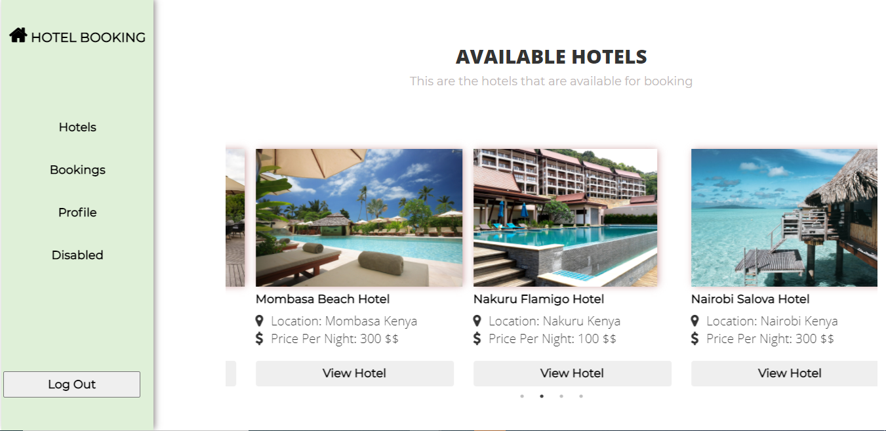

# Hotel Booking Desktop Application.

> The aim of this project is to create a desktop application that utilises Custom endpoints from a ruby on rails back end. The application is created in react and redux. Its a hotel booking application.





## Built With

- Javascript ES6
- WebPack
- HTML
- CSS
- React
- VS Code
- Redux


## How to Install

- Install Node in your system. To install Node, you can read the [Documentation](https://nodejs.org/en/download/package-manager/)
- Clone or download the zip file into your machine. CD into the folder and run

    ``` 
   npm install

    ``` 
- This will install all the dependancies.

  ``` 
  npm start

   ``` 

Runs the app in the development mode.\
Open [http://localhost:3000](http://localhost:3000) to view it in the browser.

The page will reload if you make edits.\
You will also see any lint errors in the console.


- To see the live site check here

[Live Demo Link](https://robert-booking.herokuapp.com/)

## Video Presentation

[Live Demo Link](https://www.loom.com/share/b3c9570219124ccb937f4528a7e827c9)


## Test Log in infomation:

- I have created a user for testing purposes: This are the log in information

``` 
  Email: pwambui93@gmail.com
  password:  pwambui93@gmail.com

``` 

## Need to Know:

- If you need to install it locally you need to also download and run the api backend. Here is a link to the [repository](https://github.com/peterrobert/Hotel_Booking_system)


## Authors  

👤 **Peter Robert**

- Github: [@peterrobert](https://github.com/peterrobert)
- Twitter: [@ptahwambui93](https://twitter.com/Ptahwambui93)
- Linkedin: [Peter Robert Ndungu](https://www.linkedin.com/in/peter-rob-ndungu/)


## 🤝 Contributing

Contributions, issues and feature requests are welcome!. Feel free to check the [issues page](issues/).

## Show your support
